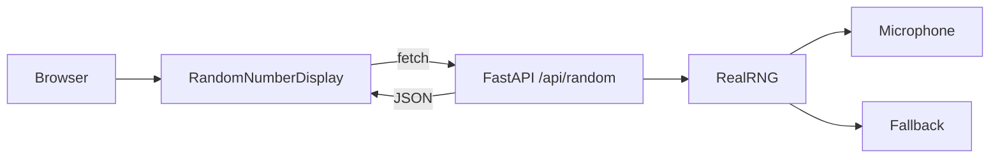
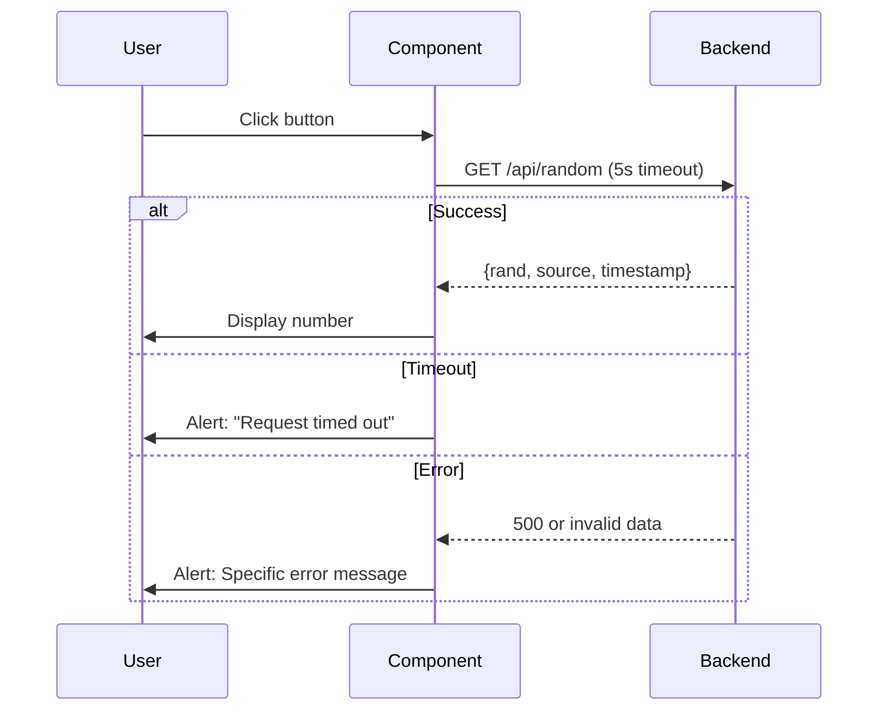

# Basic Random Number Generator

A minimalistic Next.js web interface for generating truly random numbers using the RealRNG backend (microphone-based entropy).

**Features:**
- 🎲 Fetch random numbers from backend API
- 🎤 Visual indicator for microphone/fallback source
- ⚡ 5-second timeout with error handling
- 📦 Static export ready

## Installation

```bash
npm install
```

**Backend dependency:** Requires backend server at `http://127.0.0.1:8000` (see root README)

## Quick Start

**Terminal 1 - Start Backend:**
```bash
cd ..
python src/server.py
```

**Terminal 2 - Start Frontend:**
```bash
npm run dev
```

**Open:** http://localhost:3000

Click "Pick a Number" to test.

## Configuration

Create `.env.local`:

```bash
NEXT_PUBLIC_API_URL=http://127.0.0.1:8000
```

**Note:** Variables are baked into the build. To change the API URL in production, rebuild the app.

**Production example:**
```bash
NEXT_PUBLIC_API_URL=https://api.example.com npm run build
```

## Export & Deploy

**Build static files:**
```bash
npm run build
```

Output: `out/` directory with static HTML/CSS/JS

**Deploy options:**
- **Vercel:** `vercel --prod` ([docs](https://vercel.com/docs))
- **Netlify:** `netlify deploy --dir=out` ([docs](https://docs.netlify.com))
- **GitHub Pages:** `npx gh-pages -d out` ([docs](https://pages.github.com))
- **Custom server:** Serve `out/` with any static file server

**Production checklist:**
1. Set `NEXT_PUBLIC_API_URL` to production backend
2. Rebuild the app
3. Ensure backend CORS allows your frontend domain
4. Use HTTPS for both frontend and backend

## Architecture



**Flow:**
1. User clicks "Pick a Number"
2. Component fetches from `/api/random` (5s timeout)
3. Backend returns `{rand, source, timestamp}`
4. Component validates and displays result

## API Flow



**Error handling:**
- Timeout (>5s): "Request timed out..."
- Network: "Cannot connect to backend..."
- Server (500): "Backend server error..."
- Invalid data: "Received invalid data..."

## References

**Core:**
- [Next.js 16.0.3](https://nextjs.org/docs) - React framework with SSG
- [React 19.2.0](https://react.dev) - UI library
- [Mantine 8.3.10](https://mantine.dev) - Component library
- [TypeScript 5.9.3](https://www.typescriptlang.org/docs) - Type safety

**Testing:**
- [Jest 30.2.0](https://jestjs.io) - Test framework
- [Testing Library 16.3.0](https://testing-library.com/react) - Component testing
- [Storybook 10.0.0](https://storybook.js.org) - Component development

**Backend:**
- FastAPI server at `http://127.0.0.1:8000`
- API endpoint: `GET /api/random` → `{rand: number, source: string, timestamp: string}`
